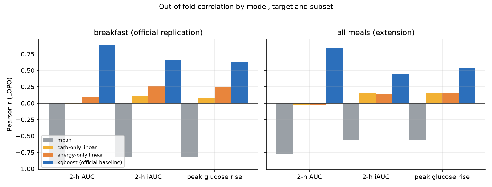
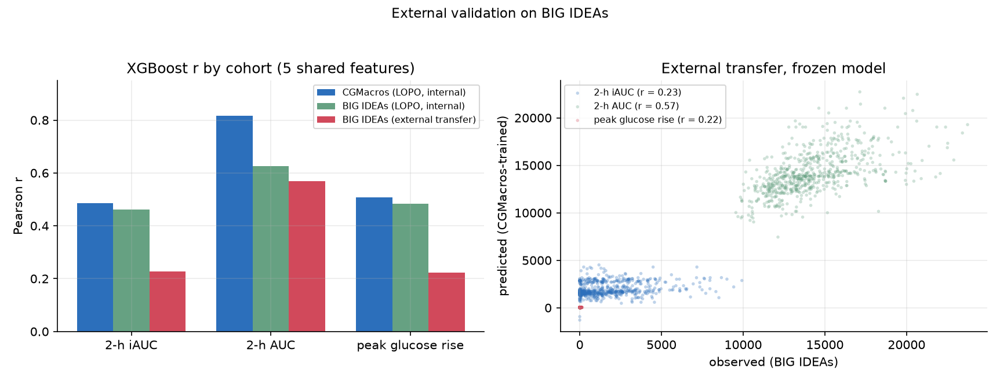

# PPGR Predictor

Predicting the **2-hour postprandial glucose response (PPGR)** to a meal from its
macronutrient composition plus a handful of subject-level clinical features.

Trained on [CGMacros](https://physionet.org/content/cgmacros/1.0.0/) (45 subjects,
1,557 meals) and validated **leave-one-subject-out (LOPO)** — every prediction is
made for a person the model has never seen.

## What this repository is (and is not)

This repo is the **demo half** of a two-repository project. The parent repository,
[`MetaNutri---AI-`](https://github.com/ElijahZhao/MetaNutri---AI-), holds the full
project: a full-stack platform *and* the `research/` module where the models below
were trained and evaluated. This repo holds only what the deployed demo needs.

- **It is** the deployment target for Streamlit Community Cloud — self-contained
  (`app.py` + `requirements.txt` at the root, ~690 KB), with models exported as
  **JSON** so no training stack is needed at runtime.
- **It is not** a submodule, a fork, or a mirror of the parent repo, and it is
  **never edited independently** — it is regenerated from the parent.
- **Flow is one way:** `MetaNutri---AI-` → this repo. Nothing flows back.
- **They do not interact at runtime:** no API calls, no shared package, no data
  exchange. The app loads the exported boosters and predicts locally.
- **Why not a submodule:** Streamlit Community Cloud builds the *repository root*
  and expects `app.py` there; a submodule would add a checkout step and a failure
  mode to that build without removing the need for this curated subset.

**Source of truth.** Every number in this README (results, external validation,
figures) is generated from the parent repo's `research/experiments/*.csv` and must
match its [technical report](reports/technical_report.pdf). If the two disagree,
the parent repository wins and this repo is regenerated.

## Results (LOPO, Pearson *r*)

| Target | Breakfast only (n=423) | All meals (n=1,557) |
|---|---|---|
| **XGBoost** — 2-h AUC | **0.890** | **0.838** |
| **XGBoost** — 2-h iAUC | **0.655** | **0.451** |
| **XGBoost** — peak glucose rise | **0.632** | **0.542** |
| energy-only linear — iAUC | 0.255 | 0.143 |
| carb-only linear — iAUC | 0.107 | 0.147 |

Reference baselines underperforming the model by a wide margin is the point: a
carbohydrate count alone explains almost none of the subject-specific response.
The breakfast-only column reproduces the CGMacros paper's own baseline
(AUC *r* ≈ 0.89, iAUC *r* ≈ 0.64); the all-meals column is this project's
extension to lunch, dinner and snacks.



## External validation (BIG IDEAs)

The frozen CGMacros model is applied, with **no retraining**, to
[BIG IDEAs](https://physionet.org/content/big-ideas-glycemic-wearable/1.1.2/)
(16 subjects, 656 meals — a different CGM device, Dexcom G6, and free-living
food logs), using only the five features shared by both datasets.

| Protocol (5 shared features) | 2-h iAUC *r* | 2-h AUC *r* | Peak *r* |
|---|---|---|---|
| CGMacros (LOPO, internal) | 0.49 | 0.82 | 0.51 |
| BIG IDEAs (LOPO, internal) | 0.46 | 0.63 | 0.48 |
| **BIG IDEAs (external transfer)** | **0.23** | **0.57** | **0.22** |
| BIG IDEAs (external, carb-only Ridge) | 0.36 | 0.29 | 0.36 |

AUC transfers partially, but iAUC and peak rise collapse — and a
carbohydrate-only Ridge regression transfers *better* on those two targets. The
BIG IDEAs internal LOPO row shows the drop is a shift between cohorts, not noise
in the external data. The demo exposes this read-only panel under
"Does it generalise to another cohort?".



## How it works

- **Features** — meal: carbohydrate / protein / fat / fiber (g), meal-time glucose.
  Subject: age, sex, BMI, HbA1c, fasting glucose, fasting insulin, HOMA-IR
  (derived), triglycerides, total cholesterol, HDL, non-HDL, LDL, VLDL, Chol/HDL.
- **Targets** — 2-h incremental AUC (positive incremental area above baseline),
  2-h total AUC, peak glucose rise.
- **Model** — XGBoost, one booster per target, `max_depth=1`,
  `n_estimators=80`, `learning_rate=0.2`.
- **Protocol** — leave-one-subject-out cross-validation. Missing features are
  imputed with **training-fold** medians and standardised with **training-fold**
  statistics, so no information leaks from the held-out subject.
- **Explanations** — exact TreeSHAP values (XGBoost `pred_contribs`).

## Run the demo locally

```bash
pip install -r requirements.txt
streamlit run app.py
```

The app predicts the three metrics, draws an *illustrative* 2-hour curve, and
shows per-feature TreeSHAP contributions.

> The models predict **scalars, not a time series**. The plotted curve is a
> population-average gamma shape scaled to the predicted peak rise and iAUC, and
> the UI labels it as a reconstruction rather than a model output.

## Repository layout

```
app.py                Streamlit demo
inference.py          model loading, prediction, TreeSHAP, curve reconstruction
model/                trained boosters + preprocessing metadata
assets/               bundled results for the external-validation panel
requirements.txt      demo dependencies (pinned)
src/                  training, evaluation and figure code
reports/              technical report + figures
experiments/          LOPO results table + external-validation results
data/README.md        data provenance and download instructions
```

To retrain:

```bash
python src/download_data.py      # fetch CGMacros (~627 MB)
python src/build_dataset.py      # build the meal-level dataset
python src/experiment.py         # run the LOPO suite
python src/train_final.py        # export the deployable models
```

## Data and license

[CGMacros](https://physionet.org/content/cgmacros/1.0.0/) — PhysioNet,
DOI [10.13026/3z8q-x658](https://doi.org/10.13026/3z8q-x658), licensed
**CC BY-NC-SA 4.0**. The raw data is **not** redistributed here; `src/download_data.py`
fetches it. Models derived from it are distributed under the same license, with
attribution to the original authors.

External validation uses
[BIG IDEAs](https://physionet.org/content/big-ideas-glycemic-wearable/1.1.2/) —
PhysioNet, DOI [10.13026/zthx-5212](https://doi.org/10.13026/zthx-5212), licensed
**ODC-By 1.0** (attribution).

## Limitations

- Small cohort (45 subjects) with a narrow demographic range; held-out
  performance on unseen subjects is much lower than within-subject performance.
- iAUC is substantially harder to predict than AUC — AUC is dominated by a
  person's overall glucose level, while iAUC isolates the meal-driven excursion.
- **External validation is modest**: AUC transfers across cohorts (r ≈ 0.57),
  but iAUC and peak rise do not (r ≈ 0.22), and a carb-only baseline transfers
  better on those two targets.
- The illustrative curve is a visual aid and is **not** a validated forecast of
  the response shape.
- **Not a medical device.** Research and portfolio use only.
