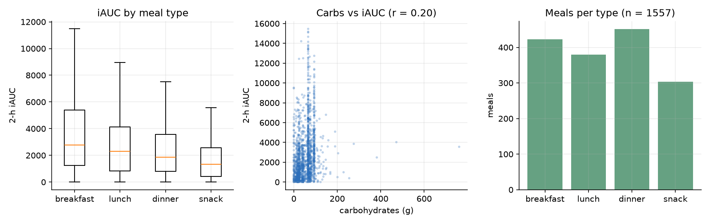
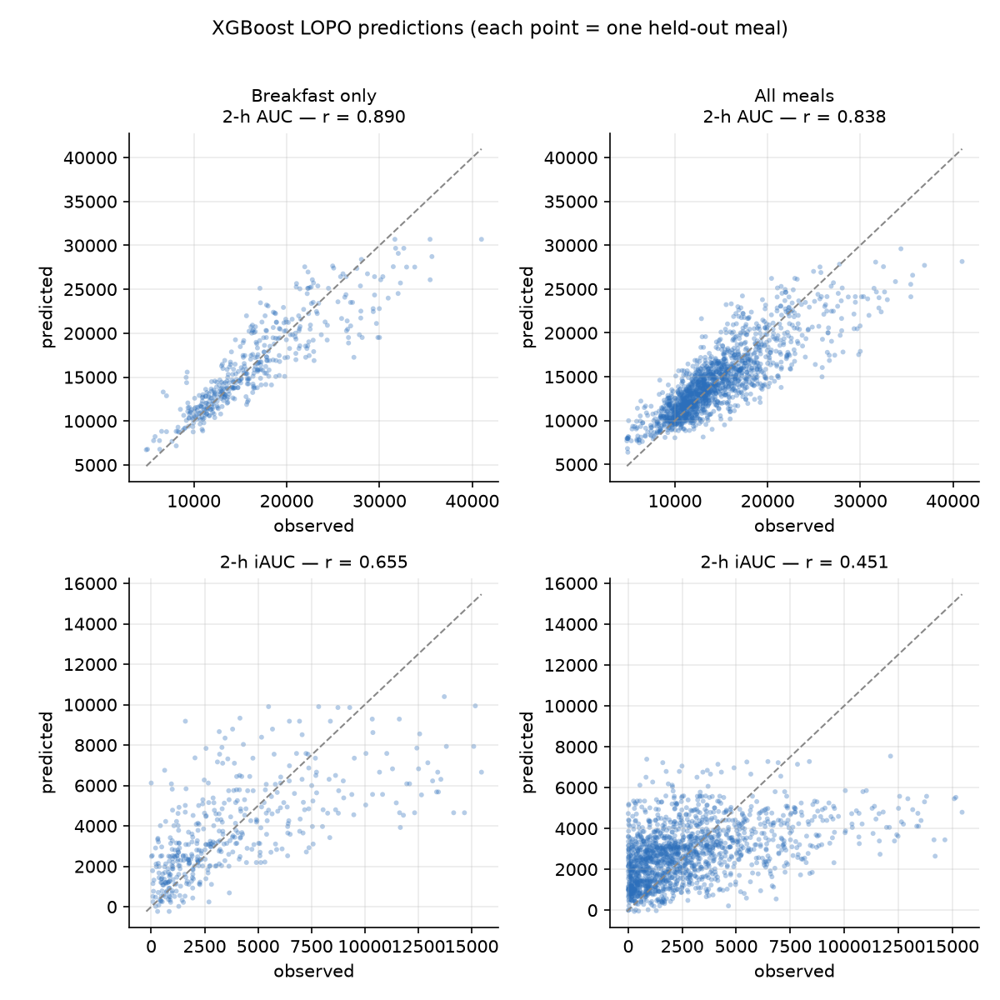
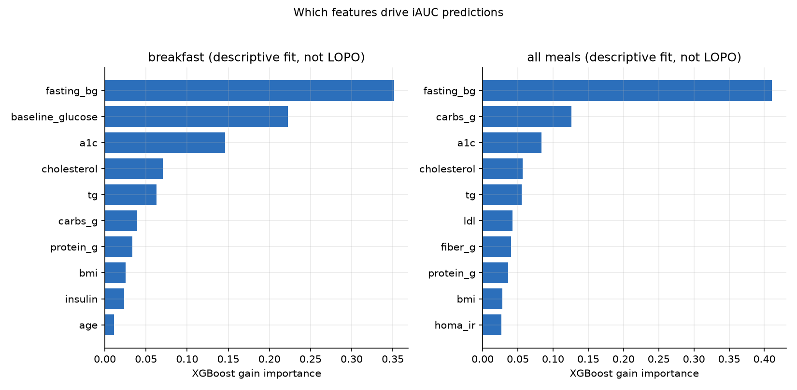

# Predicting Postprandial Glycemic Response from Meal Composition and Subject Phenotype

**A leave-one-subject-out study on the CGMacros cohort, with external validation on BIG IDEAs**

> Research module of the MetaNutri project. This is an independent, reproducible
> analysis — not a clinical tool, and not wired into the MetaNutri application.
> Datasets: CGMacros (PhysioNet, DOI `10.13026/3z8q-x658`), licensed
> **CC BY-NC-SA 4.0**, and BIG IDEAs (PhysioNet, DOI `10.13026/zthx-5212`),
> licensed **ODC-By 1.0**; see §9 for attribution.

---

## Abstract

Postprandial glucose response (PPGR) varies several-fold between individuals
eating the same meal, which makes personalised nutrition attractive but also
hard to model. We reproduce and extend the CGMacros baseline on a meal-level
table built from 45 subjects and 1,699 continuous-glucose-monitoring (CGM)
annotated meals. Using strictly subject-wise **leave-one-subject-out (LOPO)**
cross-validation, we predict three response targets — 2-hour incremental area
under the curve (iAUC), total area under the curve (AUC), and peak glucose rise
— from meal macronutrients plus subject blood-panel and anthropometric
features. On the breakfast-only subset our XGBoost model reaches
**r = 0.890 for AUC** and **r = 0.655 for iAUC**, matching the published
baseline (≈0.89 / ≈0.64), which validates the pipeline. Extending the same
features and model to all meal types (1,557 meals) yields **r = 0.838 (AUC)**
and **r = 0.451 (iAUC)**. A mean predictor and two macronutrient-only Ridge
regressions are far weaker (best linear r = 0.255 for breakfast iAUC), showing
that most of the signal is non-linear or subject-specific. We then test
cross-cohort generalisation by freezing the CGMacros model and applying it,
unchanged, to the independent **BIG IDEAs** cohort (16 subjects, 656 meals,
different CGM device and free-living self-reported food logs). AUC transfers
partially (**r = 0.569**), but iAUC and peak rise collapse to r ≈ 0.22 — and a
simple carbohydrate-only regression transfers *better* (r = 0.36) than the
tree ensemble, a cautionary result about non-linear models that fit
cohort-specific structure. We report limitations candidly: small cohorts,
pooled-observation metrics that mix between- and within-subject variance, and a
large domain gap between the two studies. Code, figures and fixed-seed
experiments are included for full reproducibility.

---

## 1. Problem

Two people can eat an identical meal and show very different glucose excursions.
Capturing that heterogeneity is the core promise of personalised nutrition, and
also its core difficulty: the response depends on meal composition, on the
person's metabolic state, and on interactions between the two.

We ask a deliberately narrow, testable question: **given a meal's
macronutrients and a set of subject-level clinical features, how well can we
predict the 2-hour postprandial glucose response, when the model is evaluated on
people it has never seen?** The emphasis on unseen subjects is the point. A
model that memorises a person's typical response will look excellent under a
random split and fail in deployment, so every number in this report comes from
LOPO cross-validation.

The intended use of this work is methodological: it is a writing and
engineering sample that demonstrates a correct evaluation protocol on real
data. It is not a medical device and makes no diagnostic claim.

---

## 2. Data

### 2.1 Source and cohort

CGMacros provides CGM traces with time-stamped meal annotations and macronutrient
estimates, plus a subject-level `bio.csv` with laboratory measurements. The
public release contains 45 subjects. Table 1 summarises the analysis cohort
after filtering.

**Table 1 — Analysis cohort.**

| Property | Value |
|---|---|
| Subjects | 45 |
| Meals with iAUC > 0 | 1,557 (of 1,699 extracted) |
| Meals per subject (min / median / max) | 17 / 35 / 61 |
| Meal types | breakfast 423, lunch 380, dinner 451, snack 303 |
| Age (min / median / max) | 18 / 51 / 69 |
| BMI (min / median / max) | 20.7 / 30.0 / 49.1 |
| HbA1c % (min / median / max) | 4.6 / 5.9 / 8.5 |
| Glycemic status (healthy / prediabetes / T2D) | 573 / 576 / 408 meals |
| Sex (M / F) | 16 / 29 |

The cohort deliberately spans healthy, prediabetic and type-2-diabetic ranges,
so the model must handle a wide dynamic range rather than a single narrow
population. The dataset is small by machine-learning standards: ~1.5k meals and
45 independent subjects. This shapes every modelling choice below.

### 2.2 From CGM traces to a meal-level table

For each meal annotation we take the 2-hour postprandial window, sample the
glucose series every 15 minutes (9 points), and compute three targets:

- **iAUC** — positive incremental area above the meal-time baseline, using
  trapezoidal integration with correct handling of curve crossings;
- **AUC** — total trapezoidal area over the window;
- **peak rise** — maximum glucose elevation above baseline.

Features are the four macronutrients (carbohydrate, protein, fat, fiber), the
meal-time baseline glucose, and 14 subject-level variables including age, sex,
BMI, HbA1c, fasting glucose, insulin, HOMA-IR and a lipid panel (triglycerides,
total cholesterol, HDL, non-HDL, LDL, VLDL, cholesterol/HDL ratio). Subject
features are joined **on subject id**, not positionally.

Two data-quality issues were handled explicitly rather than silently. First,
column names are inconsistent across the 45 per-subject files (trailing spaces,
and one file lacks `Amount Consumed`); we normalise names and access optional
columns defensively. Second, meal-type labels are inconsistent
(`Snacks`, `snack 1`, `Breakfast`, …); we collapse them to
breakfast / lunch / dinner / snack. Only one value is missing across the final
feature matrix (a single `fiber_g`), imputed with the **training-fold median**.

Figure 3 shows the resulting data: iAUC distributions differ markedly by meal
type, and carbohydrate content correlates only weakly with iAUC (r ≈ 0.2),
foreshadowing the modest ceiling of any meal-composition-only model.



**Figure 3 — Data overview.** iAUC by meal type; carbohydrate content versus
iAUC; meal counts per type.

### 2.3 External cohort: BIG IDEAs

To test whether the model generalises beyond CGMacros, we use the **BIG IDEAs
Lab Glycemic Variability and Wearable Device** dataset as an independent
external cohort. It contributes 16 subjects with Dexcom G6 CGM (5-minute) and a
free-living food log. Three differences from CGMacros matter for the analysis:

1. **Meals are not annotated.** The release provides a per-item food log; we
   group items logged within 20 minutes into one eating event and sum their
   macronutrients, matching the CGMacros target window (2 h, 9-point sampling).
2. **A narrower feature set.** BIG IDEAs does not record the CGMacros blood
   panel, so only the five shared features (carbohydrate, protein, meal-time
   baseline glucose, sex, HbA1c) are used for the primary comparison — complete
   for all 16 subjects. A seven-feature variant adding fat and fibre covers 13
   subjects (three subjects log fat/fibre sparsely or not at all) and is reported
   as a sensitivity check.
3. **Food-log dates are misaligned in the version we could obtain.** The
   dataset's own 1.1.3 release notes state *"Updated misaligned food log
   dates"*, confirming the defect. Because 1.1.3 was not retrievable (HTTP 403)
   and the open mirror carries only 1.1.2, we use 1.1.2 and repair the dates
   ourselves: for each subject we search integer day offsets and pick the shift
   that maximises the median post-meal glucose rise, subject to retaining ≥ 90 %
   of the maximum achievable event coverage. This yields no shift for 12
   subjects and a roughly five-month shift for four (007, 013, 015, 016),
   consistent with the reported defect. As an independent check, the study's
   standardised-breakfast days show a higher morning glucose rise than other
   days after correction (median Δ ≈ +14 mg/dL).

After correction, the BIG IDEAs table contains **656 meals across 16 subjects**.

---

## 3. Method

### 3.1 Evaluation protocol

We use **leave-one-subject-out cross-validation**. In each of the 45 folds, all
meals from one subject are held out; the model is fit on the remaining 44
subjects and predicts the held-out subject's meals. Standardisation and median
imputation are fit on the training fold only, so no information from the test
subject leaks into preprocessing. Metrics are computed on the pooled
out-of-fold predictions.

This matters quantitatively. Random meal-level splits let the same person appear
in train and test, and individual response baselines are highly
subject-specific, so random splits substantially overstate performance. Any
single-speaker result that is not subject-wise should be read with that
optimism in mind.

### 3.2 Models

We compare four models, deliberately spanning a naive floor and a strong
tree-based learner:

1. **Mean predictor** — predicts the training-fold mean. This is the honest
   floor: anything that cannot beat it has learned nothing.
2. **Carb-only Ridge** — linear regression on carbohydrate.
3. **Energy-only Ridge** — linear regression on carbohydrate, protein and fat.
4. **XGBoost** — gradient-boosted trees with the official CGMacros baseline
   hyper-parameters: `max_depth = 1`, `n_estimators = 80`,
   `learning_rate = 0.2`, `reg_alpha = 1.0`.

Ridge, not ordinary least squares, is used for the linear models
(`alpha = 1.0`). With 19 strongly collinear features and subjects carrying
extreme values, unregularised OLS extrapolates catastrophically on held-out
subjects (we observed R² below −1,000); a small L2 penalty makes the baseline
comparison meaningful rather than a numerical artefact. The tree depth of 1
makes each boosted round a decision *stump*, which is what keeps the model
stable in this small-sample regime.

### 3.3 Metrics

Our primary metric is the **Pearson correlation r** between observed and
predicted values under LOPO, which is what the CGMacros baseline reports and
therefore what makes replication directly comparable. We additionally report
Spearman ρ, R², RMSE and MAE. R² and RMSE are on the original, untransformed
scale (iAUC in mg/dL·min), and are more sensitive to the long right tail than
**r** is; we therefore treat **r** as the headline and the error metrics as
context. Prediction intervals are not reported because the tree ensemble does
not natively produce calibrated uncertainty for unseen subjects.

---

## 4. Results

### 4.1 Breakfast: replication of the published baseline

Restricting to breakfast (423 meals, 45 subjects) reproduces the official
protocol. Table 2 and Figure 2 show the outcome.

**Table 2 — Breakfast subset (n = 423, LOPO).**

| Model | AUC r | iAUC r | Peak r | iAUC R² | iAUC RMSE |
|---|---|---|---|---|---|
| Mean predictor | −0.924 | −0.820 | −0.826 | −0.03 | 3,474 |
| Carb-only Ridge | −0.014 | 0.107 | 0.079 | 0.00 | 3,414 |
| Energy-only Ridge | 0.100 | 0.255 | 0.247 | 0.06 | 3,313 |
| **XGBoost (official)** | **0.890** | **0.655** | **0.632** | **0.43** | **2,589** |

Our XGBoost result of **r = 0.890 (AUC)** and **r = 0.655 (iAUC)** aligns with
the published ≈0.89 and ≈0.64, which is the main validation that our dataset
construction, target definitions and evaluation split are correct. The
agreement is close enough that we treat the pipeline as a faithful
reproduction, not merely a similar-looking re-run.

The linear baselines expose the structure of the problem. Carbohydrate alone
barely correlates with iAUC (r = 0.107); adding protein and fat helps
(r = 0.255), consistent with fat and protein modulating gastric emptying and
the glycemic curve. But even the best linear model captures only ~6 % of iAUC
variance, versus ~43 % for XGBoost. The gap is the empirical case for a
non-linear model here.

The mean predictor's strongly negative correlation is a useful diagnostic
rather than a real result. Because each fold's prediction is the mean of the
*remaining* subjects, a subject with an unusually high response pulls that mean
down when held out — inducing an anti-correlation. It confirms that between-
subject differences dominate the pooled variance, and it is exactly why a
subject-wise split is mandatory.

### 4.2 All meals: an extension

We then applied the identical features and model to all meal types (1,557
meals), removing the breakfast restriction. Table 3 and Figure 1 summarise.

**Table 3 — All-meals subset (n = 1,557, LOPO).**

| Model | AUC r | iAUC r | Peak r | iAUC R² | iAUC RMSE |
|---|---|---|---|---|---|
| Mean predictor | −0.780 | −0.553 | −0.552 | −0.01 | 2,735 |
| Carb-only Ridge | −0.032 | 0.147 | 0.150 | 0.02 | 2,692 |
| Energy-only Ridge | −0.035 | 0.143 | 0.146 | 0.01 | 2,697 |
| **XGBoost (official)** | **0.838** | **0.451** | **0.542** | **0.20** | **2,431** |



**Figure 1 — Predicted versus observed under LOPO.** Each point is one held-out
meal. Left column: breakfast only; right column: all meals.

AUC remains well predicted (r = 0.838) across meal types. iAUC drops to
r = 0.451 and peak rise to r = 0.542. This is the expected direction: breakfasts
are the most standardised meal, while lunches, dinners and snacks vary far more
in composition, timing and context, and the pooled iAUC distribution becomes
heavier-tailed. The model generalises across meal types, but with a clear and
honest degradation.


**Figure 2 — Model comparison.** Out-of-fold Pearson r by model, target and
subset. XGBoost dominates everywhere; the linear baselines are close to zero,
and the mean predictor is negative by construction.

### 4.3 What the model uses

Figure 4 ranks XGBoost gain importance for iAUC. The dominant features are
meal carbohydrate, the meal-time **baseline glucose**, and the subject's
glycemic state (HbA1c, fasting glucose). This ordering is physiologically
sensible and reassuring: the model leans on the current glucose level and
long-run glycemic control, not on incidental lipid variables. Fiber and the
lipid panel contribute little once these are present.



**Figure 4 — Feature importance for iAUC.** Descriptive fit on all available
data (not LOPO); shown for interpretation, never used for model selection.

### 4.4 External validation on BIG IDEAs

The frozen CGMacros model (same 80 depth-1 trees, same five shared features) is
applied to the 656 BIG IDEAs meals without any retraining or refitting of the
preprocessing beyond the CGMacros-fitted scaler. We report three quantities side
by side: the model's **internal** LOPO score on each cohort, and its **external
transfer** score. Table 4 and Figure 5 show the outcome.

**Table 4 — XGBoost Pearson r, 5 shared features.**

| Cohort / protocol | iAUC r | AUC r | Peak r |
|---|---|---|---|
| CGMacros (LOPO, internal) | 0.487 | 0.816 | 0.508 |
| BIG IDEAs (LOPO, internal) | 0.463 | 0.625 | 0.483 |
| **BIG IDEAs (external transfer)** | **0.227** | **0.569** | **0.223** |
| BIG IDEAs (external, carb-only Ridge) | 0.362 | 0.288 | 0.357 |
| BIG IDEAs (external, mean predictor) | — (R² < 0) | — (R² ≈ 0) | — (R² < 0) |

Two things stand out. First, **AUC transfers far better than iAUC**. A
correlation of 0.569 for AUC across studies that differ in participants, device
and meal annotation is a genuine, if modest, positive result: part of the AUC
signal is a portable, physiology-level relationship (glucose level and long-run
control). Second, **iAUC and peak rise do not transfer**: r falls from 0.487 and
0.508 internally to 0.227 and 0.223 externally, and R² is near zero. The model
has learned CGMacros-specific structure for the *excursion* that does not
generalise to free-living meals in another cohort.

The internal BIG IDEAs LOPO column is the important control. It shows that
BIG IDEAs itself is *not* unlearnable — a model trained and tested within that
cohort reaches r = 0.463 for iAUC. The drop to 0.227 is therefore attributable
to **domain shift across cohorts**, not to noise in the external data.

The most uncomfortable result is the baseline comparison. On external iAUC and
peak rise, the **carbohydrate-only Ridge regression transfers better**
(r = 0.362 and 0.357) than the XGBoost model (0.227 and 0.223). The tree
ensemble, which wins decisively inside CGMacros, appears to have fit
cohort-specific interactions that do not survive the transfer, whereas the
single, near-universal "more carbohydrate → larger excursion" relationship is
more robust. The seven-feature variant adding fat and fibre changes little
(external AUC r = 0.581, iAUC r = 0.272, n = 558). We treat this as a cautionary
finding rather than a failure: it is exactly the kind of result that an external
test is meant to expose, and it would be invisible under any within-cohort
evaluation.


**Figure 5 — External validation.** Left: XGBoost Pearson r by cohort and target
under the five shared features; the red bars are the frozen-model transfer.
Right: predicted versus observed for the transferred model — the AUC cloud
follows the diagonal loosely, while iAUC and peak rise are nearly flat.

---

## 5. Discussion

Four findings are worth stating plainly.

First, **the published baseline reproduces**, and the extension is credible.
Matching r ≈ 0.89 (AUC) and r ≈ 0.64 (iAUC) on breakfast means subsequent
numbers sit on a validated pipeline rather than an idiosyncratic one.

Second, **non-linearity earns its place**. The best linear model reaches
r = 0.255 on breakfast iAUC, whereas the boosted stumps reach 0.655. With only
80 depth-1 trees, XGBoost is still a small model; the gain comes from modelling
thresholds and interactions (for example, the effect of carbohydrate differing
by baseline glucose), which a single linear coefficient cannot express.

Third, **AUC is easier than iAUC**, consistently. AUC is dominated by the
subject's overall glucose level, which the baseline and HbA1c features capture
well. iAUC subtracts that baseline and isolates the *excursion*, the part that
depends on the meal and on individual handling of it — and that is harder. This
distinction is often blurred in PPGR reporting, where a high AUC correlation
can be mistaken for good meal-response modelling.

Fourth, **external validation changes the story in a useful way**. Inside
CGMacros, XGBoost dominates the linear baselines on every target. Across
cohorts, the ranking partly reverses: the tree model still transfers for AUC
(r = 0.569) but loses to a one-variable carbohydrate regression on iAUC and peak
rise. The lesson is not that gradient boosting is wrong — it is that a model
whose advantage comes from cohort-specific interactions carries a hidden
generalisation risk, and only an external test reveals it. We would rather
report this than present a single-cohort number that flatters the method.

---

## 6. Limitations

We state these explicitly; they bound every claim above.

- **Small cohort.** 45 subjects cannot support deep models or fine-grained
  subgroup analysis. Neural approaches that need tens of thousands of samples
  are not justified here, which is why we use gradient-boosted stumps.
- **Pooled metrics mix two variance sources.** Correlations are computed over
  pooled meals, so between-subject differences inflate them relative to a
  within-subject evaluation. A per-subject standardised variant would be
  stricter and would likely lower the numbers; we report the comparable metric
  but flag the effect.
- **External validation is narrow and imperfect.** We test one external cohort
  (BIG IDEAs, 16 subjects, 656 meals) with only five shared features, because
  that cohort lacks the CGMacros blood panel. The two studies differ
  simultaneously in participants, CGM device (Libre Pro vs Dexcom G6) and meal
  annotation (expert-annotated vs free-living self-report), so the drop in
  performance cannot be attributed to any single factor. The BIG IDEAs meals are
  also derived from a 1.1.2 food log whose dates required our own repair
  procedure, which is validated but not ground truth.
- **No uncertainty quantification.** Point predictions are reported without
  calibrated intervals; for a health-adjacent setting, that is a real gap.
- **Observational and non-causal.** Associations between features and response
  are not interventions. Nothing here implies that changing a macronutrient
  will cause the predicted change.
- **Data provenance caveats.** The dataset's internal `LICENSE.txt` is an empty
  file; the CC BY-NC-SA 4.0 terms are declared only on the PhysioNet web page.
  We treat the web page as authoritative and comply with attribution and
  share-alike.

---

## 7. Future work

1. **More external cohorts and domain adaptation**, building on the BIG IDEAs
   result. Re-calibration or a small amount of target-cohort data may recover
   the iAUC signal that the frozen model loses; testing a third cohort
   (e.g. a T2D population) would separate device effects from population
   effects.
2. **Within-subject evaluation** in addition to pooled metrics, to separate
   "who is this person" from "what did they eat".
3. **Uncertainty estimates** (quantile or conformal prediction) so a prediction
   comes with a defensible interval.
4. **Richer meal representations** — meal timing, prior-meal context, and
   activity — which the current feature set omits.
5. **An interactive demo** exposing per-meal predictions and feature
   attributions, built on this frozen, reproducible pipeline.

---

## 8. Reproducibility

All results are produced by a small, dependency-pinned pipeline
(`research/`), independent of the MetaNutri platform:

```
src/download_data.py     # parallel-chunk download + SHA256 verification
src/build_dataset.py     # CGM → meal-level table (targets + features)
src/iauc.py              # iAUC / AUC / peak-rise definitions
src/evaluate.py          # LOPO protocol, imputation, baselines, XGBoost
src/experiment.py        # runs both subsets × three targets → results.csv
src/download_bigideas.py # fetch the 33 small BIG IDEAs files (2.4 MB)
src/build_external.py    # BIG IDEAs → meal-level table (date-offset repair)
src/external_validate.py # cross-cohort transfer → external_results.csv
src/make_figures.py      # figures 1–5
src/export_report_pdf.py # this report → reports/technical_report.pdf
```

Pinned versions: Python 3.12, `numpy==2.5.3`, `pandas==3.0.6`,
`scikit-learn==1.9.1`, `xgboost==3.4.1`, `scipy==1.18.1`,
`matplotlib==3.11.2`. Random seed 42. Re-running `experiment.py` regenerates
`experiments/results.csv`; `make_figures.py` regenerates the figures.

---

## 9. Data attribution and license

This work uses the **CGMacros** dataset:

- Source: PhysioNet — https://physionet.org/content/cgmacros/1.0.0/
- DOI: `10.13026/3z8q-x658`
- Reference: Das et al., *Scientific Data* 12, 1557 (2025).
- License: **Creative Commons Attribution–NonCommercial–ShareAlike 4.0
  (CC BY-NC-SA 4.0)**.

Use is non-commercial (research and portfolio). This analysis is a derivative
work and is distributed under the same license, with attribution to the
original authors. Raw data is never redistributed in this repository.

External validation uses the **BIG IDEAs Lab Glycemic Variability and Wearable
Device Data** dataset:

- Source: PhysioNet — https://physionet.org/content/big-ideas-glycemic-wearable/1.1.2/
- DOI (version 1.1.2, used here): `10.13026/zthx-5212`
- Reference: Cho, P., Kim, J., Bent, B., & Dunn, J., *BIG IDEAs Lab Glycemic
  Variability and Wearable Device Data*, PhysioNet.
- License: **Open Data Commons Attribution License 1.0 (ODC-By 1.0)**, which
  permits reuse with attribution.
