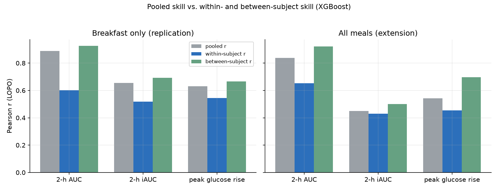
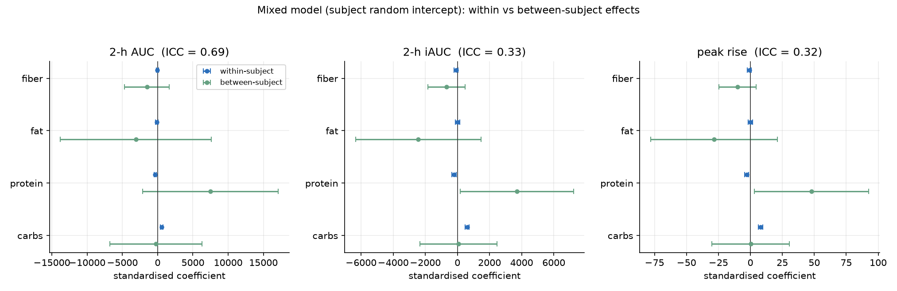

# Predicting Postprandial Glycemic Response from Meal Composition and Subject Phenotype

**A leave-one-subject-out study on the CGMacros cohort, with external validation on BIG IDEAs**

> Research module of the MetaNutri project. This is an independent, reproducible
> analysis — not a clinical tool, and not wired into the MetaNutri application.
> Datasets: CGMacros (PhysioNet, DOI `10.13026/3z8q-x658`), licensed
> **CC BY-NC-SA 4.0**, and BIG IDEAs (PhysioNet, DOI `10.13026/zthx-5212`),
> licensed **ODC-By 1.0**; see §9 for attribution.

---

## Abstract

Postprandial glucose response (PPGR) varies several-fold between individuals
eating the same meal, which makes personalised nutrition attractive but also
hard to model. We reproduce and extend the CGMacros baseline on a meal-level
table built from 45 subjects and 1,699 continuous-glucose-monitoring (CGM)
annotated meals. Using strictly subject-wise **leave-one-subject-out (LOPO)**
cross-validation, we predict three response targets — 2-hour incremental area
under the curve (iAUC), total area under the curve (AUC), and peak glucose rise
— from meal macronutrients plus subject blood-panel and anthropometric
features. On the breakfast-only subset our XGBoost model reaches
**r = 0.890 for AUC** and **r = 0.655 for iAUC**, matching the published
baseline (≈0.89 / ≈0.64), which validates the pipeline. Extending the same
features and model to all meal types (1,557 meals) yields **r = 0.838 (AUC)**
and **r = 0.451 (iAUC)**. A mean predictor and two macronutrient-only Ridge
regressions are far weaker (best linear r = 0.255 for breakfast iAUC), showing
that most of the signal is non-linear or subject-specific. We then test
cross-cohort generalisation by freezing the CGMacros model and applying it,
unchanged, to the independent **BIG IDEAs** cohort (16 subjects, 656 meals,
different CGM device and free-living self-reported food logs). AUC transfers
partially (**r = 0.569**), but iAUC and peak rise collapse to r ≈ 0.22 — and a
simple carbohydrate-only regression transfers *better* (r = 0.36) than the
tree ensemble, a cautionary result about non-linear models that fit
cohort-specific structure. A within-/between-subject decomposition shows that
the high AUC correlation is driven mainly by identifying *who* responds more,
whereas iAUC's correlation is closer to genuine meal-level ranking; median-split
ROC-AUC is 0.74–0.96 across targets. Distribution-free conformal intervals hit
their nominal marginal coverage (0.800 / 0.898) but are wide and, we show
candidly, under-cover a minority of individuals. A mixed model with subject
random intercepts locates about 69% of AUC variance *between* people versus 32%
for iAUC, and shows that, within a person, carbohydrate raises and protein
lowers the response. We report the limitations
plainly: small cohorts, pooled-observation metrics that mix between- and
within-subject variance, and a large domain gap between the two studies. Code,
figures and fixed-seed experiments are included for full reproducibility.

---

## 1. Problem

Two people can eat an identical meal and show very different glucose excursions.
Capturing that heterogeneity is the core promise of personalised nutrition, and
also its core difficulty: the response depends on meal composition, on the
person's metabolic state, and on interactions between the two.

We ask a deliberately narrow, testable question: **given a meal's
macronutrients and a set of subject-level clinical features, how well can we
predict the 2-hour postprandial glucose response, when the model is evaluated on
people it has never seen?** The emphasis on unseen subjects is the point. A
model that memorises a person's typical response will look excellent under a
random split and fail in deployment, so every number in this report comes from
LOPO cross-validation.

The intended use of this work is methodological: it is a writing and
engineering sample that demonstrates a correct evaluation protocol on real
data. It is not a medical device and makes no diagnostic claim.

---

## 2. Data

### 2.1 Source and cohort

CGMacros provides CGM traces with time-stamped meal annotations and macronutrient
estimates, plus a subject-level `bio.csv` with laboratory measurements. The
public release contains 45 subjects. Table 1 summarises the analysis cohort
after filtering.

**Table 1 — Analysis cohort.**

| Property | Value |
|---|---|
| Subjects | 45 |
| Meals with iAUC > 0 | 1,557 (of 1,699 extracted) |
| Meals per subject (min / median / max) | 17 / 35 / 61 |
| Meal types | breakfast 423, lunch 380, dinner 451, snack 303 |
| Age (min / median / max) | 18 / 51 / 69 |
| BMI (min / median / max) | 20.7 / 30.0 / 49.1 |
| HbA1c % (min / median / max) | 4.6 / 5.9 / 8.5 |
| Glycemic status (healthy / prediabetes / T2D) | 573 / 576 / 408 meals |
| Sex (M / F) | 16 / 29 |

The cohort deliberately spans healthy, prediabetic and type-2-diabetic ranges,
so the model must handle a wide dynamic range rather than a single narrow
population. The dataset is small by machine-learning standards: ~1.5k meals and
45 independent subjects. This shapes every modelling choice below.

### 2.2 From CGM traces to a meal-level table

For each meal annotation we take the 2-hour postprandial window, sample the
glucose series every 15 minutes (9 points), and compute three targets:

- **iAUC** — positive incremental area above the meal-time baseline, using
  trapezoidal integration with correct handling of curve crossings;
- **AUC** — total trapezoidal area over the window;
- **peak rise** — maximum glucose elevation above baseline.

Features are the four macronutrients (carbohydrate, protein, fat, fiber), the
meal-time baseline glucose, and 14 subject-level variables including age, sex,
BMI, HbA1c, fasting glucose, insulin, HOMA-IR and a lipid panel (triglycerides,
total cholesterol, HDL, non-HDL, LDL, VLDL, cholesterol/HDL ratio). Subject
features are joined **on subject id**, not positionally.

**Which CGM channel we use, and why it matters.** CGMacros participants wore two
sensors simultaneously (a Libre Pro sampled every 15 min, and a Dexcom G6 Pro
every 5 min). We use the **Libre** channel (`Libre GL`), matching the official
baseline, whose corresponding feature is named `Baseline_Libre` — that keeps the
replication like-for-like. The choice is not cosmetic: the two channels read
systematically differently, and they agree only moderately on *which* meals
produce the largest excursions (mean Kendall τ ≈ 0.43 across subjects;
Howard et al., 2020). Numbers produced on one channel are therefore not directly
comparable with numbers produced on the other.

Two data-quality issues were handled explicitly rather than silently. First,
column names are inconsistent across the 45 per-subject files (trailing spaces,
and one file lacks `Amount Consumed`); we normalise names and access optional
columns defensively. Second, meal-type labels are inconsistent
(`Snacks`, `snack 1`, `Breakfast`, …); we collapse them to
breakfast / lunch / dinner / snack. Only one value is missing across the final
feature matrix (a single `fiber_g`), imputed with the **training-fold median**.

Figure 3 shows the resulting data: iAUC distributions differ markedly by meal
type, and carbohydrate content correlates only weakly with iAUC (r ≈ 0.2),
foreshadowing the modest ceiling of any meal-composition-only model.


**Figure 3 — Data overview.** iAUC by meal type; carbohydrate content versus
iAUC; meal counts per type.

### 2.3 External cohort: BIG IDEAs

To test whether the model generalises beyond CGMacros, we use the **BIG IDEAs
Lab Glycemic Variability and Wearable Device** dataset as an independent
external cohort. It contributes 16 subjects with Dexcom G6 CGM (5-minute) and a
free-living food log. Three differences from CGMacros matter for the analysis:

1. **Meals are not annotated.** The release provides a per-item food log; we
   group items logged within 20 minutes into one eating event and sum their
   macronutrients, matching the CGMacros target window (2 h, 9-point sampling).
2. **A narrower feature set.** BIG IDEAs does not record the CGMacros blood
   panel, so only the five shared features (carbohydrate, protein, meal-time
   baseline glucose, sex, HbA1c) are used for the primary comparison — complete
   for all 16 subjects. A seven-feature variant adding fat and fibre covers 13
   subjects (three subjects log fat/fibre sparsely or not at all) and is reported
   as a sensitivity check.
3. **Food-log dates are misaligned in the version we could obtain.** The
   dataset's own 1.1.3 release notes state *"Updated misaligned food log
   dates"*, confirming the defect. Because 1.1.3 was not retrievable (HTTP 403)
   and the open mirror carries only 1.1.2, we use 1.1.2 and repair the dates
   ourselves: for each subject we search integer day offsets and pick the shift
   that maximises the median post-meal glucose rise, subject to retaining ≥ 90 %
   of the maximum achievable event coverage. This yields no shift for 12
   subjects and a roughly five-month shift for four (007, 013, 015, 016),
   consistent with the reported defect. As an independent check, the study's
   standardised-breakfast days show a higher morning glucose rise than other
   days after correction (median Δ ≈ +14 mg/dL).

After correction, the BIG IDEAs table contains **656 meals across 16 subjects**.

---

## 3. Method

### 3.1 Evaluation protocol

We use **leave-one-subject-out cross-validation**. In each of the 45 folds, all
meals from one subject are held out; the model is fit on the remaining 44
subjects and predicts the held-out subject's meals. Standardisation and median
imputation are fit on the training fold only, so no information from the test
subject leaks into preprocessing. Metrics are computed on the pooled
out-of-fold predictions.

This matters quantitatively. Random meal-level splits let the same person appear
in train and test, and individual response baselines are highly
subject-specific, so random splits substantially overstate performance. Any
single-speaker result that is not subject-wise should be read with that
optimism in mind.

### 3.2 Models

We compare four models, deliberately spanning a naive floor and a strong
tree-based learner:

1. **Mean predictor** — predicts the training-fold mean. This is the honest
   floor: anything that cannot beat it has learned nothing.
2. **Carb-only Ridge** — linear regression on carbohydrate.
3. **Energy-only Ridge** — linear regression on carbohydrate, protein and fat.
4. **XGBoost** — gradient-boosted trees with the official CGMacros baseline
   hyper-parameters: `max_depth = 1`, `n_estimators = 80`,
   `learning_rate = 0.2`, `reg_alpha = 1.0`.

Ridge, not ordinary least squares, is used for the linear models
(`alpha = 1.0`). With 19 strongly collinear features and subjects carrying
extreme values, unregularised OLS extrapolates catastrophically on held-out
subjects (we observed R² below −1,000); a small L2 penalty makes the baseline
comparison meaningful rather than a numerical artefact. The tree depth of 1
makes each boosted round a decision *stump*, which is what keeps the model
stable in this small-sample regime.

### 3.3 Metrics

Our primary metric is the **Pearson correlation r** between observed and
predicted values under LOPO, which is what the CGMacros baseline reports and
therefore what makes replication directly comparable. We additionally report
Spearman ρ, R², RMSE and MAE. R² and RMSE are on the original, untransformed
scale (iAUC in mg/dL·min), and are more sensitive to the long right tail than
**r** is; we therefore treat **r** as the headline and the error metrics as
context. The tree ensemble does not natively produce calibrated uncertainty, so
we add distribution-free **conformal prediction intervals** on top of it (§4.6).

Because a pooled correlation conflates two different sources of variance, we
additionally report a **within- / between-subject decomposition** (§4.5), and —
so the numbers can be compared with classification-style PPGR reporting — a
**median-split ROC-AUC** computed from the continuous predictions. The split
threshold is derived from the observed responses and is never seen by the model;
full per-model values are in `experiments/results.csv`. Repeated meals are
handled explicitly — subject random intercept plus within-subject centring, with
the within/between effects reported separately — by the mixed model in §4.7.

---

## 4. Results

### 4.1 Breakfast: replication of the published baseline

Restricting to breakfast (423 meals, 45 subjects) reproduces the official
protocol. Table 2 and Figure 2 show the outcome.

**Table 2 — Breakfast subset (n = 423, LOPO).**

| Model | AUC r | iAUC r | Peak r | iAUC R² | iAUC RMSE |
|---|---|---|---|---|---|
| Mean predictor | −0.924 | −0.820 | −0.826 | −0.03 | 3,474 |
| Carb-only Ridge | −0.014 | 0.107 | 0.079 | 0.00 | 3,414 |
| Energy-only Ridge | 0.100 | 0.255 | 0.247 | 0.06 | 3,313 |
| **XGBoost (official)** | **0.890** | **0.655** | **0.632** | **0.43** | **2,589** |

Our XGBoost result of **r = 0.890 (AUC)** and **r = 0.655 (iAUC)** aligns with
the published ≈0.89 and ≈0.64, which is the main validation that our dataset
construction, target definitions and evaluation split are correct. The
agreement is close enough that we treat the pipeline as a faithful
reproduction, not merely a similar-looking re-run.

The linear baselines expose the structure of the problem. Carbohydrate alone
barely correlates with iAUC (r = 0.107); adding protein and fat helps
(r = 0.255), consistent with fat and protein modulating gastric emptying and
the glycemic curve. But even the best linear model captures only ~6 % of iAUC
variance, versus ~43 % for XGBoost. The gap is the empirical case for a
non-linear model here.

The mean predictor's strongly negative correlation is a useful diagnostic
rather than a real result. Because each fold's prediction is the mean of the
*remaining* subjects, a subject with an unusually high response pulls that mean
down when held out — inducing an anti-correlation. It confirms that between-
subject differences dominate the pooled variance, and it is exactly why a
subject-wise split is mandatory.

### 4.2 All meals: an extension

We then applied the identical features and model to all meal types (1,557
meals), removing the breakfast restriction. Table 3 and Figure 1 summarise.

**Table 3 — All-meals subset (n = 1,557, LOPO).**

| Model | AUC r | iAUC r | Peak r | iAUC R² | iAUC RMSE |
|---|---|---|---|---|---|
| Mean predictor | −0.780 | −0.553 | −0.552 | −0.01 | 2,735 |
| Carb-only Ridge | −0.032 | 0.147 | 0.150 | 0.02 | 2,692 |
| Energy-only Ridge | −0.035 | 0.143 | 0.146 | 0.01 | 2,697 |
| **XGBoost (official)** | **0.838** | **0.451** | **0.542** | **0.20** | **2,431** |


**Figure 1 — Predicted versus observed under LOPO.** Each point is one held-out
meal. Left column: breakfast only; right column: all meals.

AUC remains well predicted (r = 0.838) across meal types. iAUC drops to
r = 0.451 and peak rise to r = 0.542. This is the expected direction: breakfasts
are the most standardised meal, while lunches, dinners and snacks vary far more
in composition, timing and context, and the pooled iAUC distribution becomes
heavier-tailed. The model generalises across meal types, but with a clear and
honest degradation.


**Figure 2 — Model comparison.** Out-of-fold Pearson r by model, target and
subset. XGBoost dominates everywhere; the linear baselines are close to zero,
and the mean predictor is negative by construction.

### 4.3 What the model uses

Figure 4 ranks XGBoost gain importance for iAUC. The dominant features are
meal carbohydrate, the meal-time **baseline glucose**, and the subject's
glycemic state (HbA1c, fasting glucose). This ordering is physiologically
sensible and reassuring: the model leans on the current glucose level and
long-run glycemic control, not on incidental lipid variables. Fiber and the
lipid panel contribute little once these are present.


**Figure 4 — Feature importance for iAUC.** Descriptive fit on all available
data (not LOPO); shown for interpretation, never used for model selection.

### 4.4 External validation on BIG IDEAs

The frozen CGMacros model (same 80 depth-1 trees, same five shared features) is
applied to the 656 BIG IDEAs meals without any retraining or refitting of the
preprocessing beyond the CGMacros-fitted scaler. We report three quantities side
by side: the model's **internal** LOPO score on each cohort, and its **external
transfer** score. Table 4 and Figure 5 show the outcome.

**Table 4 — XGBoost Pearson r, 5 shared features.**

| Cohort / protocol | iAUC r | AUC r | Peak r |
|---|---|---|---|
| CGMacros (LOPO, internal) | 0.487 | 0.816 | 0.508 |
| BIG IDEAs (LOPO, internal) | 0.463 | 0.625 | 0.483 |
| **BIG IDEAs (external transfer)** | **0.227** | **0.569** | **0.223** |
| BIG IDEAs (external, carb-only Ridge) | 0.362 | 0.288 | 0.357 |
| BIG IDEAs (external, mean predictor) | — (R² < 0) | — (R² ≈ 0) | — (R² < 0) |

Two things stand out. First, **AUC transfers far better than iAUC**. A
correlation of 0.569 for AUC across studies that differ in participants, device
and meal annotation is a genuine, if modest, positive result: part of the AUC
signal is a portable, physiology-level relationship (glucose level and long-run
control). Second, **iAUC and peak rise do not transfer**: r falls from 0.487 and
0.508 internally to 0.227 and 0.223 externally, and R² is near zero. The model
has learned CGMacros-specific structure for the *excursion* that does not
generalise to free-living meals in another cohort.

The internal BIG IDEAs LOPO column is the important control. It shows that
BIG IDEAs itself is *not* unlearnable — a model trained and tested within that
cohort reaches r = 0.463 for iAUC. The drop to 0.227 is therefore attributable
to **domain shift across cohorts**, not to noise in the external data.

The most uncomfortable result is the baseline comparison. On external iAUC and
peak rise, the **carbohydrate-only Ridge regression transfers better**
(r = 0.362 and 0.357) than the XGBoost model (0.227 and 0.223). The tree
ensemble, which wins decisively inside CGMacros, appears to have fit
cohort-specific interactions that do not survive the transfer, whereas the
single, near-universal "more carbohydrate → larger excursion" relationship is
more robust. The seven-feature variant adding fat and fibre changes little
(external AUC r = 0.581, iAUC r = 0.272, n = 558). We treat this as a cautionary
finding rather than a failure: it is exactly the kind of result that an external
test is meant to expose, and it would be invisible under any within-cohort
evaluation.


**Figure 5 — External validation.** Left: XGBoost Pearson r by cohort and target
under the five shared features; the red bars are the frozen-model transfer.
Right: predicted versus observed for the transferred model — the AUC cloud
follows the diagonal loosely, while iAUC and peak rise are nearly flat.

### 4.5 Within- versus between-subject skill, and discrimination

A pooled correlation answers two questions at once, and it is worth separating
them. **Within-subject** skill asks whether the model ranks a person's *own*
meals correctly (each subject's observed and predicted values are centred on
that subject's means before correlating). **Between-subject** skill asks whether
the model recovers *who* tends to respond more (per-subject means are correlated
across the 45 subjects). We also report a median-split ROC-AUC, which asks
whether the model can pick out above-typical from below-typical responses.

**Table 5 — XGBoost skill decomposition and discrimination (LOPO).**

| Subset | Target | Pooled r | Within-subject r | Between-subject r | ROC-AUC |
|---|---|---|---|---|---|
| Breakfast | 2-h AUC | 0.890 | 0.601 | 0.926 | 0.956 |
| Breakfast | 2-h iAUC | 0.655 | 0.519 | 0.693 | 0.875 |
| Breakfast | Peak rise | 0.632 | 0.544 | 0.667 | 0.831 |
| All meals | 2-h AUC | 0.838 | 0.654 | 0.921 | 0.910 |
| All meals | 2-h iAUC | 0.451 | 0.430 | 0.501 | 0.744 |
| All meals | Peak rise | 0.542 | 0.455 | 0.697 | 0.770 |



**Figure 6 — Pooled skill versus its within- and between-subject parts**
(XGBoost, LOPO). When the between-subject bar towers over the within-subject
bar, much of the pooled correlation reflects knowing *who* the person is.

The decomposition sharpens the AUC/iAUC contrast in §5. For AUC, between-subject
skill (0.921, all meals) is far larger than within-subject skill (0.654): a
substantial part of the impressive pooled AUC correlation is simply identifying
individuals with a higher overall glucose level, not reading the meal. For iAUC,
the two components are nearly equal (0.430 within, 0.501 between), so its
correlation is much closer to a genuine meal-level signal — a more favourable
picture of iAUC than the pooled number alone suggests, even though iAUC's
absolute correlation is lower. Peak rise sits in between.

The ROC-AUC column shows that discrimination is strong on every target
(0.74–0.96) and moves with the pooled r, so the modest iAUC correlation is not a
threshold or scale artefact: the model genuinely ranks meals less reliably for
the excursion than for the total area. For reference, the linear baselines reach
within-subject r of only ≈0.21 for iAUC and peak rise, and the mean predictor
has zero within-subject skill by construction; the full table, including each
baseline's decomposition, is in `experiments/results.csv`.

### 4.6 Prediction intervals (conformal)

A point prediction is not enough for a health-adjacent task. We add
**cross-conformal** intervals (Vovk et al.; Barber et al., 2021) on top of the
existing LOPO predictions — no new model, and the point predictions are
unchanged. For each held-out subject, the absolute residuals of all *other*
subjects serve as a calibration set; the finite-sample conformal quantile
``ceil((n+1)(1-alpha))`` gives the half-width, and the interval is ``ŷ ± q``.
Nothing about a subject's own responses is used to size its interval.

**Table 6 — Conformal intervals, XGBoost under LOPO.**

| Subset | Target | Nominal | Empirical coverage | Mean width (mg/dL·min) | Worst-subject coverage |
|---|---|---|---|---|---|
| All meals | 2-h AUC | 80% | 0.800 | 6,119 | 0.18 |
| All meals | 2-h AUC | 90% | 0.898 | 8,751 | 0.40 |
| All meals | 2-h iAUC | 80% | 0.800 | 5,357 | 0.32 |
| All meals | 2-h iAUC | 90% | 0.897 | 7,909 | 0.50 |
| Breakfast | 2-h AUC | 90% | 0.898 | 9,808 | 0.00 |
| Breakfast | 2-h iAUC | 90% | 0.896 | 8,885 | 0.30 |


**Figure 7 — Conformal intervals.** A: empirical versus nominal coverage.
B: interval width. C: per-subject coverage at 90% for iAUC, sorted — the tail
below the dashed line is the exchangeability caveat made visible.

Three things are worth stating. First, **marginal coverage is essentially
exact**: 0.800 and 0.898 against nominal 80% and 90%, as conformal theory
predicts. Second, the intervals are **wide** — the 90% interval for all-meal
iAUC spans ≈7,900 mg/dL·min, close to four times the median iAUC of ≈2,000, so
the intervals are trustworthy but coarse; they shrink with the target's
predictability (AUC intervals are narrower relative to its spread). Third, and
most important, **coverage is not uniform across subjects**: per-subject
coverage at 90% ranges from 0.50 upward for iAUC, and one breakfast-AUC subject
has *no* meals covered at 80%. Marginal validity can therefore hide individuals
who sit systematically outside the band — a direct consequence of meals within a
subject being correlated rather than exchangeable. Per-subject (Mondrian) or
residual-normalised conformal methods are the natural remedy (§7).

### 4.7 Repeated meals: mixed-effects check

§4.5 gave a *predictive* split of the LOPO skill. The plan also asks for the
complementary *inferential* treatment of repeated meals (a mixed-effects model
with a subject random intercept, plus within-subject centring and stratified
within/between reporting). We fit that model here; it answers a different
question and does not change the LOPO numbers.

For each target we fit a linear mixed model on 1,556 meals (one meal lacked a
fibre value and was dropped) with a **subject random intercept** and the
**Mundlak within-between** specification: each standardised meal-level predictor
enters both as a within-subject deviation (``cw``, "this person ate more carbs
than usual") and as the subject's mean (``cm``, "this person habitually eats more
carbs"). The random intercept absorbs the repeated-measures structure.

**Table 7 — Variance components and ICC.**

| Target | σ (subject) | σ (residual) | ICC (between-subject share) |
|---|---|---|---|
| 2-h AUC | 4,306.8 | 2,863.1 | **0.694** |
| 2-h iAUC | 1,536.5 | 2,201.2 | 0.328 |
| Peak rise | 19.4 | 28.3 | 0.321 |

The ICCs are a direct, quantitative cross-check on §4.5. For AUC, about **69%**
of the response variance sits *between* people; for iAUC and peak rise only
about **32%** does. So AUC's pooled correlation being dominated by
between-subject skill is not an artefact of the metric — it reflects where the
variance actually lives. It also matches the external estimate that repeated
meals are only weakly reproducible within a person (Hengist et al., 2023;
ICC 0.16–0.31).

**Table 8 — Standardised within- vs between-subject effects** (coefficient ± SE;
only carbs and protein are shown — fat and fibre are indistinguishable from zero
within subjects).

| Target | Predictor | Within-subject | Between-subject |
|---|---|---|---|
| 2-h AUC | carbs | **+581.6 ± 88.6** | −258.7 ± 3,337.5 |
| 2-h AUC | protein | **−340.2 ± 85.8** | +7,483.3 ± 4,913.8 |
| 2-h iAUC | carbs | **+605.6 ± 68.2** | +65.3 ± 1,221.9 |
| 2-h iAUC | protein | **−214.9 ± 66.0** | +3,701.8 ± 1,799.6 |
| Peak rise | carbs | **+7.9 ± 0.9** | +0.3 ± 15.5 |
| Peak rise | protein | **−2.9 ± 0.8** | +47.9 ± 22.8 |



**Figure 8 — Mixed model (subject random intercept).** Standardised within- and
between-subject coefficients with 95% intervals; each panel has its own x-scale
because the targets differ by orders of magnitude.

Two conclusions follow. First, **within a person, carbohydrates raise and protein
lowers the response**, significantly and in the same direction for all three
targets — the two effects that survive once stable between-person differences
are absorbed; fat and fibre do not. Second, the **between-subject coefficients
are an order of magnitude less precise** (only 45 people) and, for protein, flip
sign — the association across *people* points the opposite way to the one within
a person. That divergence is a concrete reason to distrust population-level
macronutrient predictors as personal ones, and it reinforces the caution in §5.

---

## 5. Discussion

Four findings are worth stating plainly.

First, **the published baseline reproduces**, and the extension is credible.
Matching r ≈ 0.89 (AUC) and r ≈ 0.64 (iAUC) on breakfast means subsequent
numbers sit on a validated pipeline rather than an idiosyncratic one.

Second, **non-linearity earns its place**. The best linear model reaches
r = 0.255 on breakfast iAUC, whereas the boosted stumps reach 0.655. With only
80 depth-1 trees, XGBoost is still a small model; the gain comes from modelling
thresholds and interactions (for example, the effect of carbohydrate differing
by baseline glucose), which a single linear coefficient cannot express.

Third, **AUC is easier than iAUC**, consistently. AUC is dominated by the
subject's overall glucose level, which the baseline and HbA1c features capture
well. iAUC subtracts that baseline and isolates the *excursion*, the part that
depends on the meal and on individual handling of it — and that is harder. This
distinction is often blurred in PPGR reporting, where a high AUC correlation
can be mistaken for good meal-response modelling. The within-/between-subject
decomposition in §4.5 makes the point directly: AUC's pooled r is dominated by
between-subject skill, whereas iAUC's two components are nearly equal.

Fourth, **external validation changes the story in a useful way**. Inside
CGMacros, XGBoost dominates the linear baselines on every target. Across
cohorts, the ranking partly reverses: the tree model still transfers for AUC
(r = 0.569) but loses to a one-variable carbohydrate regression on iAUC and peak
rise. The lesson is not that gradient boosting is wrong — it is that a model
whose advantage comes from cohort-specific interactions carries a hidden
generalisation risk, and only an external test reveals it. We would rather
report this than present a single-cohort number that flatters the method.

---

## 6. Limitations

We state these explicitly; they bound every claim above.

- **Small cohort.** 45 subjects cannot support deep models or fine-grained
  subgroup analysis. Neural approaches that need tens of thousands of samples
  are not justified here, which is why we use gradient-boosted stumps.
- **Pooled metrics mix two variance sources.** The headline correlations are
  computed over pooled meals, so between-subject differences inflate them
  relative to a purely within-subject evaluation — for AUC, most of the pooled
  value is between-subject skill (§4.5). We report the decomposition alongside
  the pooled metric, but the pooled number alone should not be read as
  meal-level skill.
- **The response is only weakly repeatable within a person.** The same meal, eaten again a week later, does not reliably reproduce its excursion: reported within-subject ICCs for postprandial response are only 0.16–0.31 (Hengist et al., 2023). Our own mixed model agrees, with ICC 0.32 for iAUC and peak rise (§4.7); for AUC the ICC is 0.69, i.e. most of that variance is between people rather than between meals of the same person. This is a ceiling on how much of the variance *any*
  composition-driven model can explain, and it is a property of the cohort we
  use, not of our pipeline.
- **CGM measurement is noisy, lagged and device-dependent.** Subcutaneous
  glucose lags blood glucose by roughly 9–10 min, which blurs fast postprandial
  peaks; because our window is anchored on the annotated meal time, the lag
  shifts the target rather than invalidating it. Measurement also depends on
  which sensor channel is used, and the two channels in this study agree only
  moderately on meal ranking (τ ≈ 0.43; see §2.2 and Howard et al., 2020).
- **Confounding is uncontrolled.** Meal timing, the interval since the previous
  meal, physical activity, sleep and menstrual cycle all influence the
  postprandial response and are not features here. The correlations above
  therefore describe association under this study's conditions, not an isolated
  causal effect of macronutrients.
- **Meal annotation quality differs across cohorts.** CGMacros meals are
  expert-annotated; BIG IDEAs is a free-living, self-reported food log subject to
  the usual portion-estimation error. Part of the cross-cohort drop in §4.4 is
  therefore a difference in measurement, not only in modelling.
- **External validation is narrow and imperfect.** We test one external cohort
  (BIG IDEAs, 16 subjects, 656 meals) with only five shared features, because
  that cohort lacks the CGMacros blood panel. The two studies differ
  simultaneously in participants, CGM device (Libre Pro vs Dexcom G6) and meal
  annotation (expert-annotated vs free-living self-report), so the drop in
  performance cannot be attributed to any single factor. The BIG IDEAs meals are
  also derived from a 1.1.2 food log whose dates required our own repair
  procedure, which is validated but not ground truth.
- **Intervals are only marginally valid.** We do report conformal intervals
  (§4.6), and their marginal coverage matches nominal (0.800 / 0.898). But the
  coverage is not uniform across people — per-subject coverage falls to 0.50 for
  iAUC and to 0.00 for one breakfast-AUC subject — and the intervals are wide.
  They should be read as population-level guarantees, not per-person ones.
- **Observational and non-causal.** Associations between features and response
  are not interventions. Nothing here implies that changing a macronutrient
  will cause the predicted change.
- **Reproducibility in this field is poor, which cuts both ways.** An audit of
  deep-learning glucose-prediction papers found that only 23.9 % released code,
  37.3 % used private data, and 55.2 % of the remainder relied on OhioT1DM
  — a 12-person cohort. That makes an open, subject-wise-evaluated pipeline a
  genuine differentiator, but it also means most published numbers are not
  directly comparable with ours.
- **Data provenance caveats.** The dataset's internal `LICENSE.txt` is an empty
  file; the CC BY-NC-SA 4.0 terms are declared only on the PhysioNet web page.
  We treat the web page as authoritative and comply with attribution and
  share-alike.

---

## 7. Future work

1. **More external cohorts and domain adaptation**, building on the BIG IDEAs
   result. Re-calibration or a small amount of target-cohort data may recover
   the iAUC signal that the frozen model loses; testing a third cohort
   (e.g. a T2D population) would separate device effects from population
   effects.
2. **Adaptive / per-subject conformal prediction** (Mondrian or
   residual-normalised), so interval coverage is uniform across people rather
   than only marginal — §4.6 shows the current intervals under-cover specific
   individuals even though the pooled coverage is on target.
3. **Richer meal representations** — meal timing, prior-meal context, activity,
   and **meal type as an explicit feature** (we currently use meal type only to
   define evaluation subsets, not as an input to the model).
4. **Per-subject reporting on larger cohorts.** The within-/between-subject
   split in §4.5 is pooled over 45 subjects; per-subject correlations with
   confidence intervals need more meals per person than this cohort provides.

An interactive demo exposing per-meal predictions and exact TreeSHAP
attributions on this frozen pipeline is already deployed
(<https://metanutri-ai-ppgr-predictor.streamlit.app/>); see §8 for the code.

---

## 8. Reproducibility

All results are produced by a small, dependency-pinned pipeline
(`research/`), independent of the MetaNutri platform. The entire chain — from
raw download to the figures and this PDF — runs with **one command** from
`research/`:

```bash
bash src/run_all.sh                    # full pipeline
bash src/run_all.sh --skip-download    # reuse already-downloaded archives
```

It runs, in order:

```
src/download_data.sh     # parallel-chunk download + SHA256 verification
src/download_bigideas.py # fetch the 33 small BIG IDEAs files (2.4 MB)
src/build_dataset.py     # CGM → meal-level table (uses src/iauc.py for targets)
src/experiment.py        # LOPO protocol, baselines, XGBoost (uses src/evaluate.py);
                         #   breakfast replication × all-meals extension × three targets
                         #   → experiments/results.csv
src/build_external.py    # BIG IDEAs → meal-level table (date-offset repair)
src/external_validate.py # cross-cohort transfer → experiments/external_results.csv
src/make_figures.py      # figures 1–6
src/uncertainty.py       # conformal intervals → table 6, figure 7, experiments/uncertainty.csv
src/mixed_effects.py     # subject random intercept → tables 7–8, figure 8
                         #   → experiments/mixed_effects_{variance,coefficients}.csv (statsmodels)
src/train_final.py       # freeze the model into app/model/ for the demo
src/export_report_pdf.py # this report → reports/technical_report.pdf
```

(`iauc.py` and `evaluate.py` are library modules imported by the steps above,
not separate entry points.)

Pinned versions: Python 3.12, `numpy==2.5.3`, `pandas==3.0.6`,
`scikit-learn==1.9.1`, `xgboost==3.4.1`, `scipy==1.18.1`,
`matplotlib==3.11.2`. Random seed 42. Re-running `experiment.py` regenerates
`experiments/results.csv`; `make_figures.py` regenerates the figures.

---

## 9. Data attribution and license

This work uses the **CGMacros** dataset:

- Source: PhysioNet — https://physionet.org/content/cgmacros/1.0.0/
- DOI: `10.13026/3z8q-x658`
- Reference: Das et al., *Scientific Data* 12, 1557 (2025).
- License: **Creative Commons Attribution–NonCommercial–ShareAlike 4.0
  (CC BY-NC-SA 4.0)**.

Use is non-commercial (research and portfolio). This analysis is a derivative
work and is distributed under the same license, with attribution to the
original authors. Raw data is never redistributed in this repository.

External validation uses the **BIG IDEAs Lab Glycemic Variability and Wearable
Device Data** dataset:

- Source: PhysioNet — https://physionet.org/content/big-ideas-glycemic-wearable/1.1.2/
- DOI (version 1.1.2, used here): `10.13026/zthx-5212`
- Reference: Cho, P., Kim, J., Bent, B., & Dunn, J., *BIG IDEAs Lab Glycemic
  Variability and Wearable Device Data*, PhysioNet.
- License: **Open Data Commons Attribution License 1.0 (ODC-By 1.0)**, which
  permits reuse with attribution.
